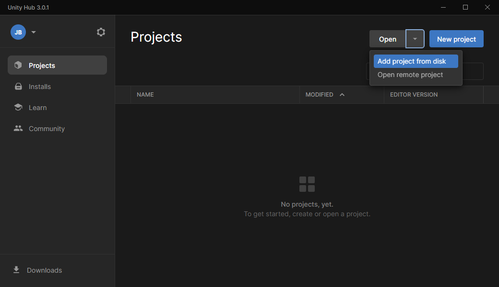
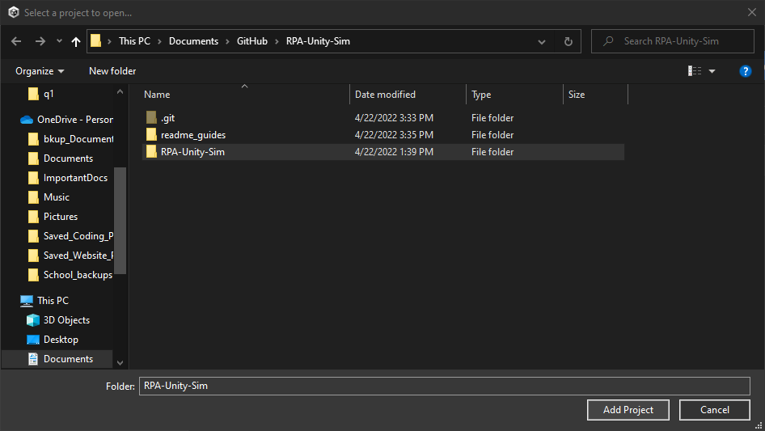
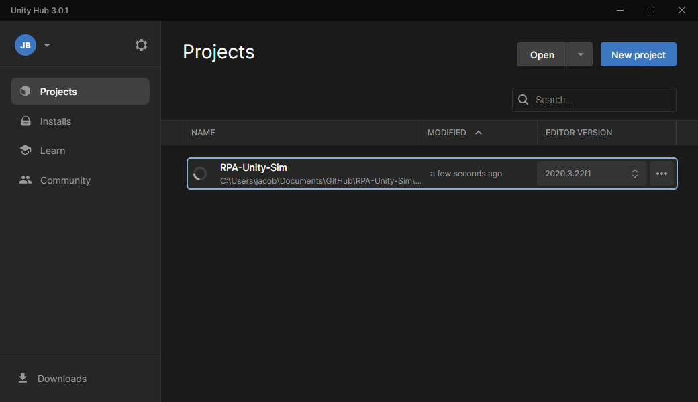
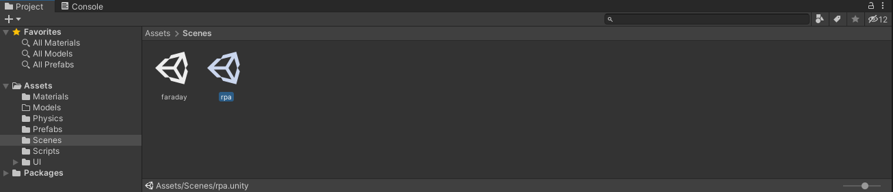
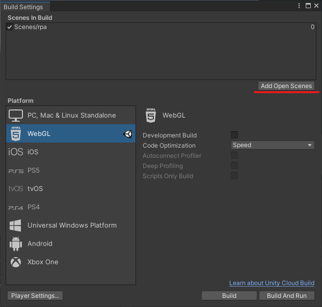
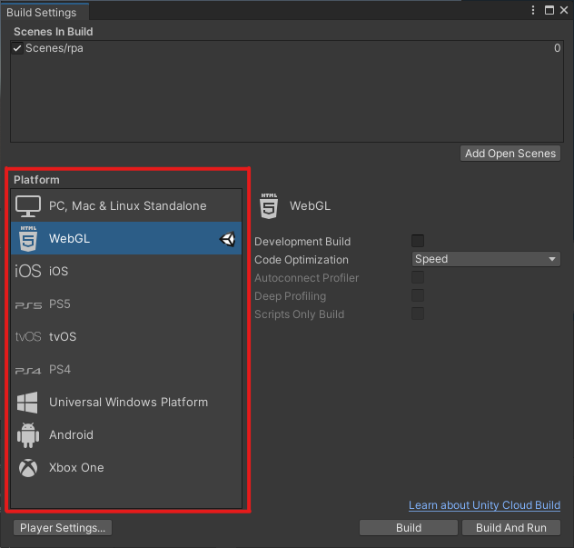
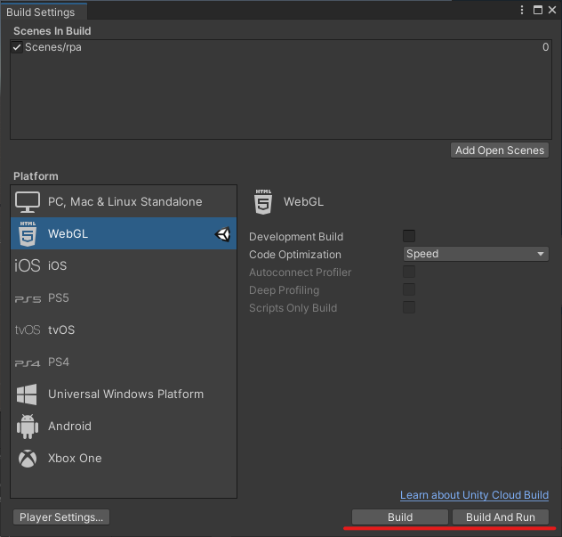

# 2022_05a_Diagnostics-Vis-Unity-Sim

Unity Files for both Diagnostic Simulations

## Team Members
* Jacob Burton
* Peter Bugala
* Alex Darrah
* Albert Schaffer
* Anderson Sanchez
* Tyler Vaillancourt

#### Arizona State University

This project can only be opened in Unity. To rebuild the project in different executables

## Steps to rebuild using Unity:
### 1. Download the project.
### 2. Open Unity Hub
### 3. Select open, then Add the Project from disk

### 4. Open the project, RPA-Unity-Sim

### 5. Once in Unity, Open the desired Simulation Scene

### 6. Navigate to the Build Settings Window through File -> Build Settings

### 7. Add the Current Scene to the build Order

### 8. Select desired platform and settings

### 9. Select Build!

## What Was Used
**Frameworks:** Unity  
**IDE:** Visual Studio 2019  
**Programming Languages:** C#  
